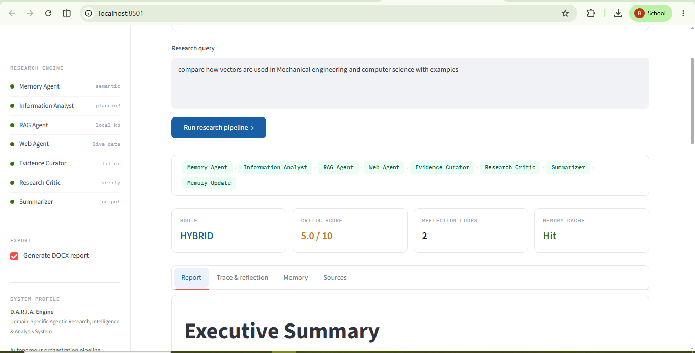
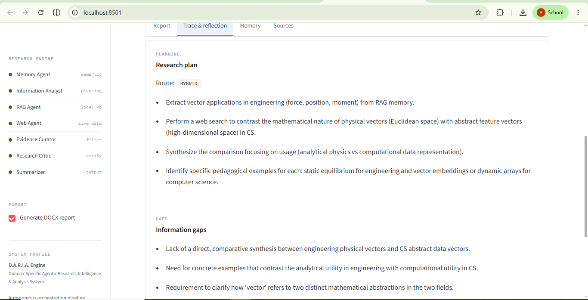
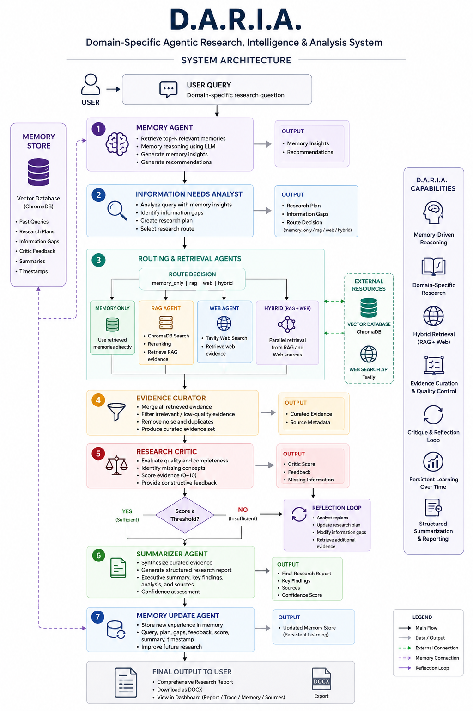
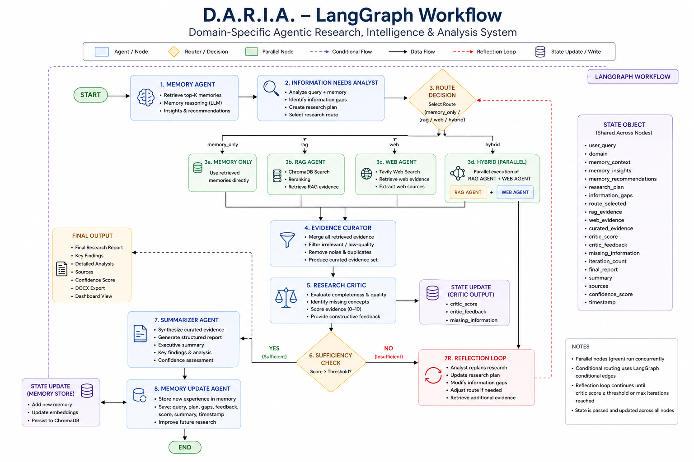
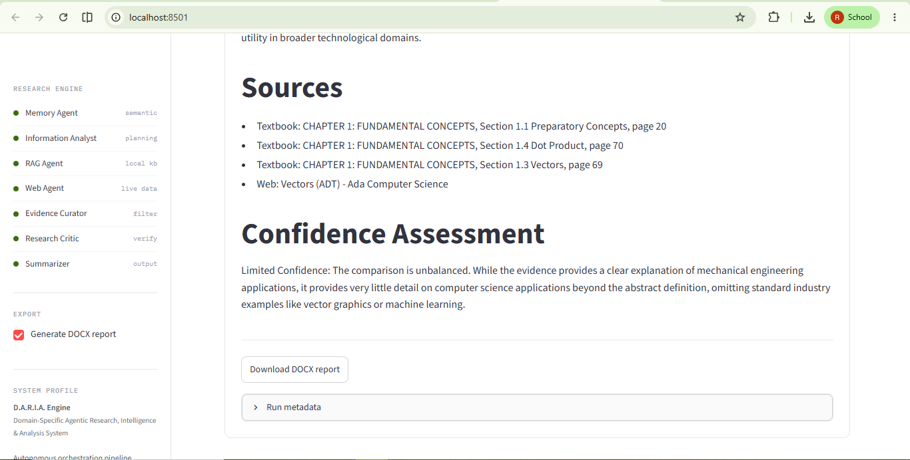

# 🧠 D.A.R.I.A.

## Domain-Specific Agentic Research, Intelligence & Analysis System


A memory-driven multi-agent research system that combines **persistent memory**, **domain-specific RAG**, **web research**, **evidence curation**, **research critique**, and **reflection loops** to generate evidence-backed research reports.

---

## 📸 Application Overview



*Streamlit interface showing memory-driven research, hybrid retrieval, reflection loops, and structured report generation.*

---

## 🎥 Project Demo

[](https://youtu.be/1komiPJ-WrQ)

### Demo Highlights

* 🧠 Persistent Memory
* 📋 Research Planning
* 📚 Domain-Specific RAG
* 🌐 Web Research
* 🔄 Hybrid Retrieval
* ⚖️ Research Critique
* ♻️ Reflection Loops
* 📄 DOCX Report Export

▶️ **Watch Full Demo:** https://youtu.be/YOUR_VIDEO_ID

---

## 🎯 Motivation

Traditional RAG systems retrieve information and generate answers but often lack:

* Long-term memory
* Research planning
* Evidence quality assessment
* Self-correction mechanisms
* Persistent learning

D.A.R.I.A. addresses these limitations through a multi-agent architecture that plans, researches, critiques, reflects, and learns from previous research sessions.

---

## 🏗️ System Architecture



```text
User Query
     │
     ▼
Memory Agent
     │
     ▼
Information Analyst
     │
 ┌───┴────┐
 ▼        ▼
RAG      Web
 │        │
 └───┬────┘
     ▼
Evidence Curator
     ▼
Research Critic
     ▼
Reflection Loop
     ▼
Summarizer
     ▼
Memory Update
     ▼
Final Report
```

---

## 🔄 LangGraph Workflow



### Workflow Features

* Conditional Routing
* Parallel Hybrid Retrieval
* Reflection Loops
* Shared State Management
* Persistent Memory Integration

### Routing Modes

* **memory_only** → Memory contains sufficient information
* **rag** → Domain-specific retrieval
* **web** → Dynamic and recent information
* **hybrid** → Parallel RAG + Web execution

---

## ⚙️ Core Components

### 🧠 Memory Agent

* Retrieves previous research experiences
* Generates memory insights
* Produces research recommendations
* Enables persistent learning

### 📋 Information Needs Analyst

* Analyzes user queries
* Identifies information gaps
* Creates research plans
* Selects retrieval strategies

### 📚 Retrieval Layer

#### Domain-Specific RAG

* ChromaDB Vector Store
* BGE Embeddings
* Semantic Retrieval

#### Web Research

* Tavily Search
* Dynamic Knowledge Acquisition

#### Hybrid Retrieval

* Parallel RAG + Web execution
* Improved evidence coverage
* Reduced latency

### 🔍 Evidence Curator

* Merges evidence
* Filters noise
* Removes irrelevant information
* Produces curated evidence packages

### ⚖️ Research Critic

* Scores evidence quality
* Detects missing concepts
* Generates improvement feedback
* Drives reflection loops

### 📝 Summarizer Agent

Generates structured reports containing:

* Executive Summary
* Key Findings
* Detailed Analysis
* Sources
* Confidence Assessment

### 💾 Memory Update Agent

Stores:

* Research Plans
* Information Gaps
* Critic Feedback
* Critic Scores
* Research Summaries

---

## 🧠 Reflection & Critique


Unlike conventional RAG systems, D.A.R.I.A. evaluates and improves its own research.

### Reflection Workflow

```text
Research
    ↓
Critique
    ↓
Replanning
    ↓
Retrieval
    ↓
Improved Research
```

The Research Critic evaluates evidence quality and identifies deficiencies. If evidence is insufficient, critic feedback is converted into new information gaps and research plans, triggering another retrieval cycle.

---

## 📄 Generated Research Reports



The system produces professional research reports containing:

* Executive Summary
* Key Findings
* Detailed Analysis
* Source Traceability
* Confidence Assessment

### Additional Features

* DOCX Export
* Research Trace Dashboard
* Memory Insights
* Source Transparency

---

## 🚀 Key Innovations

### Memory-Augmented Research

Stores research experiences and uses them to improve future investigations.

### Research Planning Layer

Transforms user questions into structured research plans and information gaps.

### Corpus-Aware Routing

Dynamically selects:

* Memory
* RAG
* Web
* Hybrid

based on information needs.

### Parallel Hybrid Retrieval

Executes RAG and Web retrieval concurrently.

### Evidence Curation

Filters evidence before evaluation and summarization.

### Critique-Based Reflection

Uses a dedicated Research Critic to evaluate evidence quality and drive iterative improvement.

### Persistent Learning

Stores research outcomes for future reuse.

### Explainable Research

Exposes planning, retrieval, critique, and summarization stages to users.

---

## 🛠️ Technology Stack

| Layer                | Technology       |
| -------------------- | ---------------- |
| Agent Framework      | LangGraph        |
| LLM Orchestration    | LiteLLM          |
| Research Model       | Gemini 2.5 Flash |
| Vector Database      | ChromaDB         |
| Embeddings           | BAAI BGE Small   |
| Web Search           | Tavily           |
| Knowledge Processing | Docling          |
| Frontend             | Streamlit        |
| Export               | python-docx      |

---

## 📊 Features

✅ Persistent Memory

✅ Dynamic Route Selection

✅ Domain-Specific RAG

✅ Web Research

✅ Parallel Hybrid Retrieval

✅ Evidence Curation

✅ Research Critique

✅ Reflection Loop

✅ Structured Summarization

✅ DOCX Report Export

---

## 📁 Project Structure

```text
DARIA/
│
├── agents/
│   ├── memory_agent.py
│   ├── information_needs_analyst.py
│   ├── rag_agent.py
│   ├── web_agent.py
│   ├── evidence_curator.py
│   ├── research_critic.py
│   ├── summarizer_agent.py
│   └── memory_update.py
│
├── graph/
│   ├── graph.py
│   ├── routing.py
│   └── state.py
│
├── memory/
│   ├── store_memory.py
│   ├── retrieve_memory.py
│   ├── memory_reasoner.py
│   └── chroma_client.py
│
├── rag/
│   ├── retriever.py
│   ├── reranker.py
│   └── vector_store.py
│
├── prompts/
│   ├── analyst_prompt.py
│   ├── curator_prompt.py
│   ├── critic_prompt.py
│   ├── memory_prompt.py
│   └── summarizer_prompt.py
│
├── export/
│   └── docx_exporter.py
│
├── schemas/
│   └── schemas.py
│
├── images/
│   ├── dashboard.png
│   ├── architecture.png
│   ├── langgraph_workflow.png
│   ├── research_critic.png
│   ├── final_report.png
│   └── demo_thumbnail.png
│
├── streamlit_app.py
├── requirements.txt
├── README.md
└── .env
```

---

## ⚡ Installation

```bash
git clone https://github.com/yourusername/DARIA.git

cd DARIA

python -m venv .venv

source .venv/bin/activate
# Windows:
# .venv\Scripts\activate

pip install -r requirements.txt
```

Create a `.env` file:

```env
GEMINI_API_KEY=your_key
TAVILY_API_KEY=your_key
```

Run:

```bash
streamlit run ui/streamlit_app.py
```

---

## 🔮 Future Roadmap

### D.A.R.I.A. V2

* Multi-Domain Corpora
* Multimodal RAG
* Memory Relevance Ranking
* Source Credibility Scoring
* Adaptive Retrieval Strategies
* Autonomous Task Decomposition
* Agent Benchmarking
* Performance Analytics

---

## 💡 What I Learned

This project reinforced that high-quality AI research systems require much more than retrieval.

The most valuable insight was that effective research workflows emerge from the interaction of **memory, planning, retrieval, evaluation, reflection, and learning**, rather than from a single model generating an answer.

By combining these components within a LangGraph architecture, D.A.R.I.A. moves beyond traditional question-answering toward explainable and continuously improving research systems.
